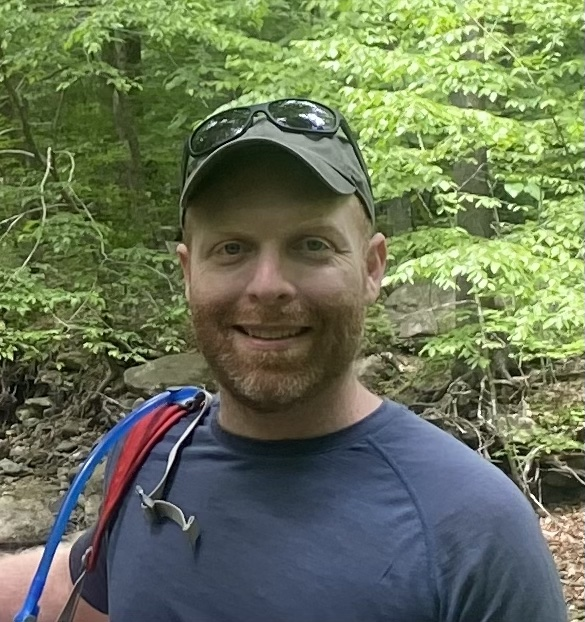

# Josh Malina - Mental Health Coach

Hi! I'm Josh. I am a mental health coach specializing in Internal Family Systems (IFS), a mindfulness teacher, and a software developer. I live and work in Washington D.C.

## About

I believe that real healing is possible, and through tools like Internal Family Systems and mindfulness based practices, we can make real progress in establishing space, freedom and growth in our minds and in our lives.

I have been a daily meditator since 2017, and try to attend a retreat once a year.

### Certifications and Trainings

- Bonnie Weiss’ Inner Critic IFS Course (Bonnie Weiss, May 2022)
- IFSCA 16 Week Comprehensive IFS course (Melissa Galbraith, August 2023)

In 2023, I started teaching Saturday mindfulness classes to women transitioning out of homelessness. I also serve as the teacher coordinator for the Sunday night sangha, [Downtown Dharma](https://www.downtowndharmadc.org/), in Washington D.C.

## How it works

Most sessions take place in my home in Woodley Park, DC, though I am open to working remotely with clients who do not live locally. 

I charge $75 per 50 minute session, but offer a sliding scale for clients who cannot afford this rate. 

## Getting Started

Send me an email at joshuamalina@gmail.com to chat and find a time to meet.
