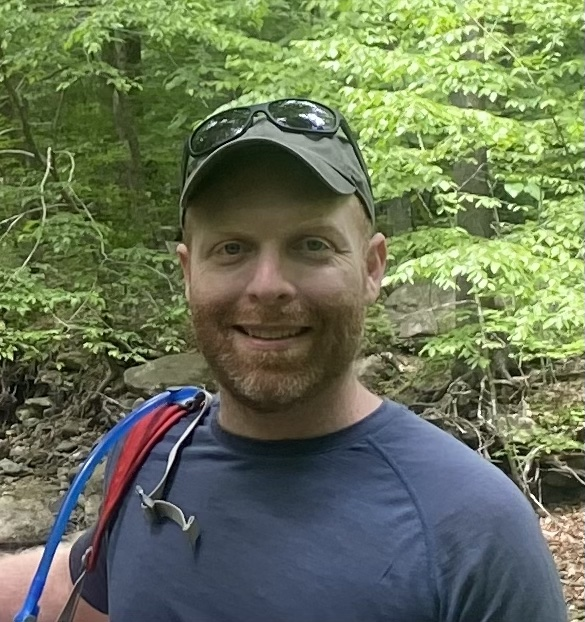

# Josh Malina - Mental Health Coach

Hi! I'm Josh. I am a mental health coach specializing in Internal Family Systems (IFS), a mindfulness teacher, and a software developer. 

## About

I believe that real healing is possible, and through tools like Internal Family Systems and mindfulness based practices, we can make real progress in establishing space, freedom and growth in our minds and in our lives.

I have been a daily meditator since 2017, and try to attend a retreat once a year.

### Certifications and Trainings

- IFSCA IFS Advanced Weekend (Gustavo Ribeiro de Mello, October 2023)
- IFSCA 16 Week Comprehensive IFS course (Melissa Galbraith, August 2023)
- Bonnie Weiss’ Inner Critic IFS Course (Bonnie Weiss, May 2022)

## How it works

Most sessions take place online through zoom. 

I charge $75 per 50 minute session, but offer a sliding scale for clients who cannot afford this rate. 

## Getting Started

Send me an email at joshuamalina@gmail.com to chat and find a time to meet, or book a free consultation through my calendly: https://calendly.com/anxietybookclub

## Testimonials

*Working with Josh as my IFS practitioner has been an amazing experience. With his guidance, I've been able to learn so much about myself and the parts of me that I never really understood before. I highly recommend Josh to anyone who wants to deepen their self-awareness and embark on a journey of personal growth.* --Olivia

*Josh's coaching, guidance, and introduction of IFS to me provided credence to a way we all speak about ourselves naturally, that we have parts of ourselves with their own feelings, fears, and dreams. Josh provided a calm and welcoming space to intentionally invite these parts forward for the first time and they opened up, some willing, some begrudgingly. I recommend Josh guide you through IFS so you may add a long lever in your mental health and self reflection toolboxes.* --Diran
